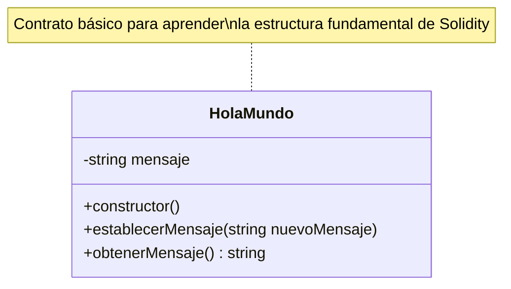

# 01. Hola Mundo

¡Bienvenido al primer tema del curso de Solidity! Este es tu punto de partida para aprender a escribir contratos inteligentes.

## 📚 ¿Qué aprenderás?

En este módulo básico aprenderás:
- La estructura fundamental de un contrato en Solidity
- Cómo declarar variables de estado
- Cómo crear funciones para leer y modificar datos
- La sintaxis básica del lenguaje

## 📊 Diagrama UML del Contrato



## 🔍 Componentes del Contrato

### 1. Licencia y Pragma
```solidity
// SPDX-License-Identifier: MIT
pragma solidity ^0.8.0;
```
- **SPDX-License-Identifier**: Especifica la licencia del código
- **pragma solidity**: Define la versión del compilador a usar

### 2. Variable de Estado
```solidity
string mensaje;
```
- Las variables de estado se almacenan permanentemente en la blockchain
- Pueden ser de diferentes tipos: string, uint, address, bool, etc.

### 3. Constructor
```solidity
constructor() {
    mensaje = "Hola Mundo";
}
```
- Se ejecuta una sola vez al desplegar el contrato
- Inicializa el estado del contrato

### 4. Funciones
```solidity
function establecerMensaje(string memory _mensaje) public {
    mensaje = _mensaje;
}

function obtenerMensaje() public view returns (string memory) {
    return mensaje;
}
```
- **public**: La función puede ser llamada desde cualquier lugar
- **view**: La función solo lee datos, no modifica el estado
- **memory**: Ubicación temporal de datos en memoria

## 💡 Conceptos Clave

### Variables de Estado
- Se almacenan en la blockchain
- Persisten entre llamadas de función
- Cuestan gas para escribir, pero no para leer (en llamadas view)

### Funciones View
- No modifican el estado del contrato
- No requieren gas cuando se llaman externamente
- Perfectas para consultar información

### Modificadores de Acceso
- **public**: Accesible desde cualquier lugar
- **private**: Solo accesible dentro del contrato
- **internal**: Accesible en el contrato y contratos heredados
- **external**: Solo accesible desde fuera del contrato

## 🎯 Ejercicio Práctico

1. **Despliega el contrato** en Remix
2. **Llama a `obtenerMensaje()`** para ver el mensaje inicial
3. **Llama a `establecerMensaje("Tu mensaje")`** con un nuevo texto
4. **Llama nuevamente a `obtenerMensaje()`** para verificar el cambio

## 🚀 Próximos Pasos

Una vez que domines este contrato básico, estarás listo para:
- Explorar diferentes tipos de datos (Tema 2)
- Aprender operadores y expresiones (Tema 3)
- Trabajar con estructuras de control (Tema 4)

## 📝 Notas Importantes

- Cada modificación a una variable de estado cuesta gas
- Las funciones `view` o `pure` no cuestan gas cuando se llaman externamente
- El mensaje se almacena en la blockchain de forma permanente
- Cualquiera puede llamar a `establecerMensaje()` y cambiar el mensaje

---

¡Felicidades por dar tu primer paso en el desarrollo de contratos inteligentes! 🎉