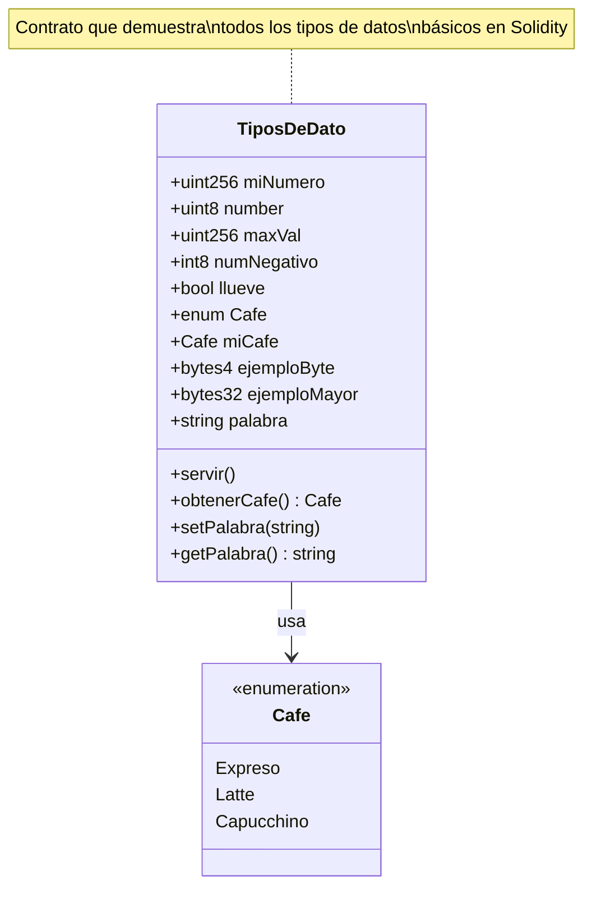

# 02. Tipos de Dato

Este módulo explora los diferentes tipos de datos disponibles en Solidity, fundamentales para construir contratos inteligentes robustos y eficientes.

## 📚 ¿Qué aprenderás?

En este módulo aprenderás sobre:
- Tipos numéricos enteros (uint, int)
- Tipos booleanos
- Direcciones (address)
- Enumeraciones (enum)
- Bytes de tamaño fijo
- Strings
- Valores máximos y mínimos de tipos

## 📊 Diagrama UML del Contrato



## 🔍 Tipos de Datos en Solidity

### 1. Tipos Numéricos Enteros

#### Enteros Sin Signo (uint)
```solidity
uint256 miNumero;        // 0 a 2^256 - 1
uint8 number = 10;       // 0 a 255
uint256 public maxVal = type(uint256).max;
```

**Características:**
- Solo números positivos (0 en adelante)
- Diferentes tamaños: uint8, uint16, uint32, ..., uint256
- uint = uint256 (por defecto)

**Rangos comunes:**
- `uint8`: 0 a 255
- `uint16`: 0 a 65,535
- `uint256`: 0 a ~1.15 × 10^77

#### Enteros Con Signo (int)
```solidity
int8 numNegativo = -4;   // -128 a 127
```

**Características:**
- Pueden ser positivos o negativos
- Mismo rango de tamaños que uint
- int = int256 (por defecto)

### 2. Tipo Booleano
```solidity
bool llueve = true;      // true o false
```

**Usos comunes:**
- Flags y estados
- Condiciones y validaciones
- Control de acceso

### 3. Tipo Address
```solidity
address owner = 0x165468433...;
address payable recipient;
```

**Características:**
- Almacena direcciones Ethereum (20 bytes)
- `address`: dirección normal
- `address payable`: puede recibir Ether

### 4. Enumeraciones (Enum)
```solidity
enum Cafe {Expreso, Latte, Capucchino}
Cafe public miCafe;

function servir() public {
    miCafe = Cafe.Capucchino;
}
```

**Ventajas:**
- Código más legible
- Valores predefinidos
- Ahorro de gas vs strings
- Seguridad de tipos

### 5. Bytes de Tamaño Fijo
```solidity
bytes4 public ejemploByte = "Hola";
bytes32 public ejemploMayor = "Hola";
```

**Tamaños:**
- bytes1 hasta bytes32
- Más eficiente en gas que arrays dinámicos
- Útil para hashes y firmas

### 6. Strings
```solidity
string public palabra = "Adios";

function setPalabra(string memory _nuevaPalabra) public {
    palabra = _nuevaPalabra;
}
```

**Consideraciones:**
- Tamaño dinámico
- Codificación UTF-8
- Más costoso en gas que bytes
- No se pueden comparar directamente

## 💡 Comparativa de Tipos

| Tipo | Tamaño | Rango | Uso Principal |
|------|---------|-------|---------------|
| `uint8` | 1 byte | 0-255 | Contadores pequeños |
| `uint256` | 32 bytes | 0-2^256 | Valores monetarios |
| `int8` | 1 byte | -128-127 | Números pequeños con signo |
| `bool` | 1 byte | true/false | Flags y condiciones |
| `address` | 20 bytes | Dirección Ethereum | Cuentas y contratos |
| `bytes32` | 32 bytes | 32 bytes fijos | Hashes, IDs |
| `string` | Dinámico | Variable | Texto |

## 🎯 Mejores Prácticas

### Optimización de Gas
1. **Usa el tipo más pequeño posible:**
   ```solidity
   uint8 edad;      // ✅ Mejor para valores 0-255
   uint256 edad;    // ❌ Desperdicio si solo necesitas 0-255
   ```

2. **Agrupa variables del mismo tamaño:**
   ```solidity
   // ✅ Optimizado
   uint128 a;
   uint128 b;
   uint256 c;
   
   // ❌ No optimizado
   uint128 a;
   uint256 c;
   uint128 b;
   ```

3. **Usa bytes32 en lugar de string cuando sea posible:**
   ```solidity
   bytes32 public id;     // ✅ Más eficiente
   string public id;      // ❌ Más costoso
   ```

### Seguridad
1. **Verifica overflows (aunque Solidity 0.8+ lo hace automáticamente):**
   ```solidity
   uint8 num = 255;
   num++;  // Revierte en Solidity 0.8+
   ```

2. **Usa tipos apropiados para valores monetarios:**
   ```solidity
   uint256 balance;  // ✅ Para Wei
   ```

## 🔬 Ejercicios Prácticos

### Ejercicio 1: Explora Rangos
```solidity
uint8 maximo = type(uint8).max;    // 255
uint256 maximoGrande = type(uint256).max;
int8 minimo = type(int8).min;      // -128
```

### Ejercicio 2: Usa Enum
```solidity
enum Estado {Pendiente, Activo, Completado}
Estado public miEstado;

function cambiarEstado(Estado _nuevoEstado) public {
    miEstado = _nuevoEstado;
}
```

### Ejercicio 3: Trabaja con Addresses
```solidity
address public propietario;

constructor() {
    propietario = msg.sender;
}

function esPropietario() public view returns (bool) {
    return msg.sender == propietario;
}
```

## 📝 Notas Importantes

- **Overflow Protection**: Solidity 0.8+ previene overflows automáticamente
- **Default Values**: Todas las variables tienen valores por defecto (0, false, "", etc.)
- **Memory vs Storage**: Strings usan `memory` en funciones, `storage` como estado
- **Gas Costs**: Tipos más grandes cuestan más gas al almacenar

## 🚀 Próximos Pasos

Con estos tipos de datos dominados, estarás listo para:
- Realizar operaciones con ellos (Tema 3: Operadores)
- Usarlos en estructuras de control (Tema 4)
- Combinarlos en estructuras complejas (Tema 6: Structs)

---

¡Domina los tipos de datos para construir contratos más eficientes y seguros! 💪