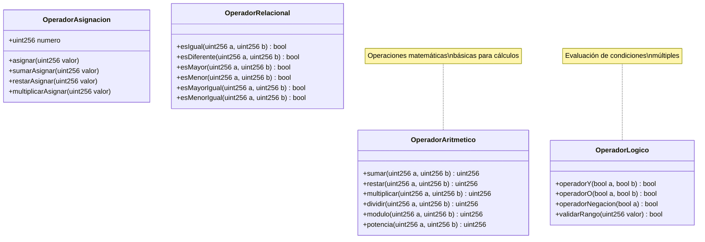

# 03. Operadores

Este módulo explora los diferentes tipos de operadores en Solidity, esenciales para realizar cálculos, comparaciones y tomar decisiones en tus contratos inteligentes.

## 📚 ¿Qué aprenderás?

En este módulo aprenderás sobre:
- Operadores aritméticos (+, -, *, /, %, **)
- Operadores de asignación (=, +=, -=, etc.)
- Operadores relacionales (==, !=, <, >, <=, >=)
- Operadores lógicos (&&, ||, !)
- Precedencia de operadores

## 📊 Diagrama UML del Módulo



## 🔍 Tipos de Operadores

### 1. Operadores Aritméticos

#### Operaciones Básicas
```solidity
uint256 suma = a + b;           // Suma
uint256 resta = a - b;          // Resta
uint256 producto = a * b;       // Multiplicación
uint256 cociente = a / b;       // División
uint256 residuo = a % b;        // Módulo (residuo)
uint256 potencia = a ** b;      // Potencia
```

**Ejemplo Práctico:**
```solidity
function calcularPromedio(uint256 a, uint256 b, uint256 c) 
    public 
    pure 
    returns (uint256) 
{
    return (a + b + c) / 3;
}
```

**⚠️ Precauciones:**
- División por cero causa revert
- División entera (sin decimales)
- Overflow protegido en Solidity 0.8+

### 2. Operadores de Asignación

```solidity
uint256 numero;

numero = 10;        // Asignación simple
numero += 5;        // numero = numero + 5 (15)
numero -= 3;        // numero = numero - 3 (12)
numero *= 2;        // numero = numero * 2 (24)
numero /= 4;        // numero = numero / 4 (6)
numero %= 5;        // numero = numero % 5 (1)
```

**Ventajas:**
- Código más conciso
- Menos gas (en algunos casos)
- Mayor legibilidad

### 3. Operadores Relacionales

```solidity
bool resultado;

resultado = a == b;    // Igual a
resultado = a != b;    // Diferente de
resultado = a > b;     // Mayor que
resultado = a < b;     // Menor que
resultado = a >= b;    // Mayor o igual que
resultado = a <= b;    // Menor o igual que
```

**Ejemplo Práctico:**
```solidity
function esAdulto(uint256 edad) public pure returns (bool) {
    return edad >= 18;
}

function estaEnRango(uint256 valor, uint256 min, uint256 max) 
    public 
    pure 
    returns (bool) 
{
    return valor >= min && valor <= max;
}
```

### 4. Operadores Lógicos

```solidity
bool a = true;
bool b = false;

bool resultadoY = a && b;      // AND (false)
bool resultadoO = a || b;      // OR (true)
bool resultadoNot = !a;        // NOT (false)
```

**Tabla de Verdad:**

| A | B | A && B | A \|\| B | !A |
|---|---|--------|----------|-----|
| T | T | T | T | F |
| T | F | F | T | F |
| F | T | F | T | T |
| F | F | F | F | T |

**Ejemplo Práctico:**
```solidity
function puedeVotar(uint256 edad, bool esCiudadano, bool estaRegistrado) 
    public 
    pure 
    returns (bool) 
{
    return edad >= 18 && esCiudadano && estaRegistrado;
}
```

## 💡 Precedencia de Operadores

De mayor a menor precedencia:

1. **Paréntesis** `()`
2. **Potencia** `**`
3. **Unarios** `!`, `-`, `+`
4. **Multiplicación/División/Módulo** `*`, `/`, `%`
5. **Suma/Resta** `+`, `-`
6. **Relacionales** `<`, `>`, `<=`, `>=`
7. **Igualdad** `==`, `!=`
8. **AND lógico** `&&`
9. **OR lógico** `||`
10. **Asignación** `=`, `+=`, `-=`, etc.

**Ejemplo:**
```solidity
uint256 resultado = 10 + 5 * 2;        // 20 (no 30)
uint256 resultado2 = (10 + 5) * 2;     // 30 (con paréntesis)
```

## 🎯 Casos de Uso Comunes

### 1. Validación de Rangos
```solidity
function validarPrecio(uint256 precio) public pure returns (bool) {
    return precio >= 100 && precio <= 1000;
}
```

### 2. Cálculos Financieros
```solidity
function calcularDescuento(uint256 precio, uint256 porcentaje) 
    public 
    pure 
    returns (uint256) 
{
    return precio - (precio * porcentaje / 100);
}
```

### 3. Control de Acceso
```solidity
function puedeAcceder(address usuario, bool esPremium, uint256 edad) 
    public 
    pure 
    returns (bool) 
{
    return usuario != address(0) && (esPremium || edad >= 18);
}
```

### 4. Operaciones con Tiempo
```solidity
function haExpirado(uint256 tiempoInicio, uint256 duracion) 
    public 
    view 
    returns (bool) 
{
    return block.timestamp > tiempoInicio + duracion;
}
```

## 🔬 Ejercicios Prácticos

### Ejercicio 1: Calculadora Completa
```solidity
contract Calculadora {
    function calcular(uint256 a, uint256 b, string memory operacion) 
        public 
        pure 
        returns (uint256) 
    {
        if (keccak256(bytes(operacion)) == keccak256(bytes("suma"))) {
            return a + b;
        } else if (keccak256(bytes(operacion)) == keccak256(bytes("resta"))) {
            return a - b;
        }
        // ... más operaciones
        revert("Operacion no valida");
    }
}
```

### Ejercicio 2: Validador de Condiciones
```solidity
function esValido(uint256 edad, uint256 saldo, bool activo) 
    public 
    pure 
    returns (bool) 
{
    return edad >= 18 && saldo > 0 && activo;
}
```

### Ejercicio 3: Cálculo de Interés
```solidity
function calcularInteres(uint256 capital, uint256 tasa, uint256 tiempo) 
    public 
    pure 
    returns (uint256) 
{
    return (capital * tasa * tiempo) / 100;
}
```

## 📝 Mejores Prácticas

### 1. Evita División por Cero
```solidity
// ❌ Peligroso
uint256 resultado = a / b;

// ✅ Seguro
require(b != 0, "Division por cero");
uint256 resultado = a / b;
```

### 2. Usa Paréntesis para Claridad
```solidity
// ❌ Confuso
bool resultado = a > 10 && b < 20 || c == 5;

// ✅ Claro
bool resultado = (a > 10 && b < 20) || (c == 5);
```

### 3. Maneja Overflow (pre-0.8)
```solidity
// Solidity 0.8+ lo hace automáticamente
// Para versiones anteriores, usa SafeMath de OpenZeppelin
```

### 4. Optimiza Operaciones
```solidity
// ✅ Más eficiente
uint256 resultado = valor * 2;

// ❌ Menos eficiente
uint256 resultado = valor ** 2;  // Para multiplicar por 2
```

## ⚡ Optimización de Gas

| Operación | Costo Relativo | Recomendación |
|-----------|----------------|---------------|
| `+`, `-` | Bajo | Preferir |
| `*`, `/` | Medio | Usar cuando necesario |
| `**` | Alto | Evitar si es posible |
| `%` | Medio | Usar con cuidado |

## 🚀 Próximos Pasos

Con los operadores dominados, estarás listo para:
- Combinarlos en estructuras de control (Tema 4)
- Usarlos en funciones complejas (Tema 5)
- Aplicarlos en validaciones y cálculos avanzados

---

¡Domina los operadores para construir lógica poderosa en tus contratos! 💪