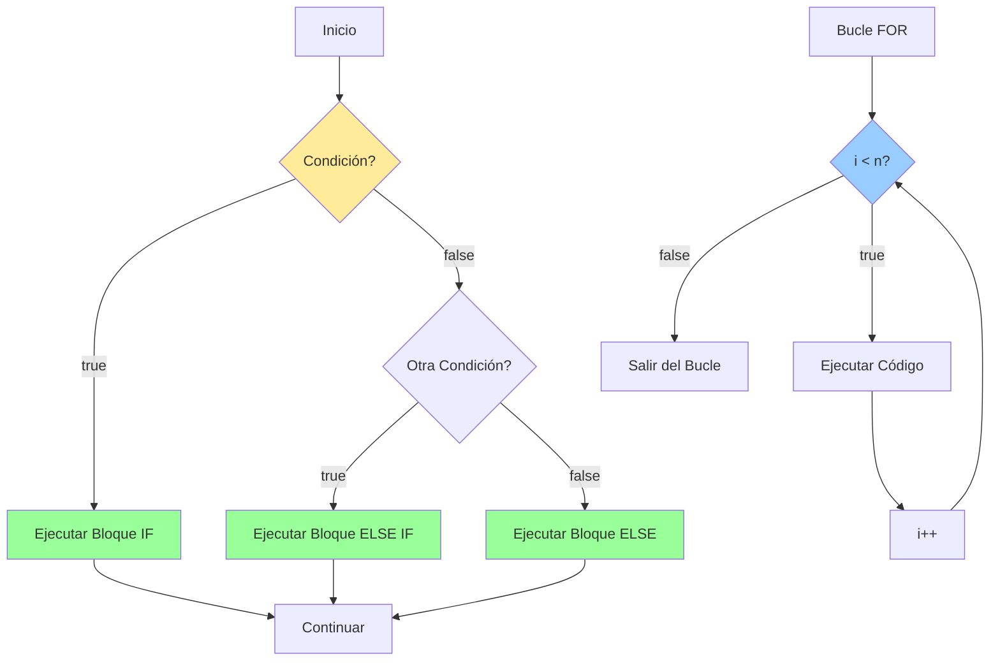

# 04. Estructuras de Control

Esta sección explora las estructuras de control en Solidity, fundamentales para la lógica de los contratos inteligentes. Aquí aprenderás cómo tomar decisiones y repetir acciones dentro de tus contratos.

## 📚 ¿Qué aprenderás?

En este módulo aprenderás sobre:
- Condicionales (`if`, `else`, `else if`)
- Bucles (`for`, `while`, `do/while`)
- Control de flujo (`break`, `continue`, `return`)
- Validación de números primos
- Patrones de iteración seguros

## 📊 Diagrama UML del Contrato



## Temas cubiertos

- **Condicionales (`if`, `else`, `else if`)**: Permiten ejecutar código dependiendo de si se cumple una condición.
- **Bucles `for`**: Ejecutan un bloque de código un número determinado de veces.
- **Bucles `while` y `do/while`**: Ejecutan código mientras se cumpla una condición.
- **Control de flujo (`break`, `continue`, `return`)**: Modifican el comportamiento de los bucles y funciones.

## Ejemplo básico

```solidity
// SPDX-License-Identifier: MIT
pragma solidity ^0.8.0;

contract EstructurasDeControl {
    uint public contador;

    function ejemploIfElse(uint valor) public {
        if (valor > 10) {
            contador = valor;
        } else if (valor == 10) {
            contador = 10;
        } else {
            contador = 0;
        }
    }

    function ejemploFor() public {
        contador = 0;
        for (uint i = 0; i < 5; i++) {
            contador += i;
        }
    }

    function ejemploWhile() public {
        contador = 0;
        uint i = 0;
        while (i < 3) {
            contador += i;
            i++;
        }
    }
}
```

## 🔍 Estructuras de Control en Detalle

### 1. Condicionales

#### If / Else / Else If
```solidity
function clasificarNumero(uint256 numero) public pure returns (string memory) {
    if (numero > 100) {
        return "Grande";
    } else if (numero > 50) {
        return "Mediano";
    } else if (numero > 0) {
        return "Pequeño";
    } else {
        return "Cero";
    }
}
```

**Características:**
- Evalúa condiciones de forma secuencial
- Solo se ejecuta el primer bloque que cumpla la condición
- `else` es opcional y captura todos los casos no manejados

### 2. Bucle For

```solidity
function sumarHastaN(uint256 n) public pure returns (uint256) {
    uint256 suma = 0;
    for (uint256 i = 0; i < n; i++) {
        suma += i;
    }
    return suma;
}
```

**Estructura:**
- **Inicialización**: `uint256 i = 0`
- **Condición**: `i < n`
- **Incremento**: `i++`

**Uso común:**
- Iterar sobre rangos conocidos
- Procesar arrays
- Cálculos repetitivos

### 3. Bucle While

```solidity
function potenciaDeDos(uint256 exponente) public pure returns (uint256) {
    uint256 resultado = 1;
    uint256 i = 0;
    
    while (i < exponente) {
        resultado *= 2;
        i++;
    }
    
    return resultado;
}
```

**Características:**
- Evalúa la condición antes de cada iteración
- Si la condición es falsa al inicio, no se ejecuta

### 4. Bucle Do-While

```solidity
function ejemploDoWhile(uint256 n) public pure returns (uint256) {
    uint256 contador = 0;
    uint256 i = 0;
    
    do {
        contador += i;
        i++;
    } while (i < n);
    
    return contador;
}
```

**Características:**
- Siempre se ejecuta al menos una vez
- Evalúa la condición después de cada iteración

### 5. Control de Flujo

#### Break
```solidity
function encontrarPrimerMultiplo(uint256 n, uint256 multiplo) 
    public 
    pure 
    returns (uint256) 
{
    for (uint256 i = 1; i <= n; i++) {
        if (i % multiplo == 0) {
            return i;  // Equivalente a break + return
        }
    }
    return 0;  // No encontrado
}
```

#### Continue
```solidity
function sumarPares(uint256 n) public pure returns (uint256) {
    uint256 suma = 0;
    
    for (uint256 i = 0; i <= n; i++) {
        if (i % 2 != 0) {
            continue;  // Salta los impares
        }
        suma += i;
    }
    
    return suma;
}
```

#### Return
```solidity
function esMayorDe18(uint256 edad) public pure returns (bool) {
    if (edad >= 18) {
        return true;  // Salida temprana
    }
    return false;
}
```

## 💡 Ejercicios Incluidos en el Contrato

### 1. Suma de Números Pares
```solidity
function sumaPares(uint n) public pure returns (uint)
```
Suma todos los números pares menores a `n`.

### 2. Cuenta Regresiva
```solidity
function cuentaRegresiva(uint n) public
```
Decrementa desde `n` hasta 0 usando un bucle `while`.

### 3. Break y Continue
```solidity
function sumaHastaMultiploDeSiete(uint n) public pure returns (uint)
```
Suma números pares hasta encontrar un múltiplo de 7.

### 4. Validador de Números Primos
```solidity
function esPrimo(uint n) public pure returns (bool)
```
Determina si un número es primo usando bucles.

## 🎯 Casos de Uso Reales

### Sistema de Calificación
```solidity
function obtenerCalificacion(uint256 nota) public pure returns (string memory) {
    if (nota >= 90) return "A";
    else if (nota >= 80) return "B";
    else if (nota >= 70) return "C";
    else if (nota >= 60) return "D";
    else return "F";
}
```

### Búsqueda en Array
```solidity
function buscarEnArray(uint256[] memory arr, uint256 valor) 
    public 
    pure 
    returns (bool) 
{
    for (uint256 i = 0; i < arr.length; i++) {
        if (arr[i] == valor) {
            return true;
        }
    }
    return false;
}
```

### Validación de Rango
```solidity
function validarRango(uint256 valor, uint256 min, uint256 max) 
    public 
    pure 
    returns (bool) 
{
    if (valor < min) return false;
    if (valor > max) return false;
    return true;
}
```

## ⚠️ Precauciones Importantes

### 1. Gas y Bucles
```solidity
// ❌ PELIGROSO - Puede agotar el gas
function bucleInfinito() public {
    while (true) {
        // Esto nunca terminará
    }
}

// ✅ SEGURO - Límite definido
function bucleSeguro(uint256 n) public pure returns (uint256) {
    require(n <= 100, "Limite excedido");
    uint256 suma = 0;
    for (uint256 i = 0; i < n; i++) {
        suma += i;
    }
    return suma;
}
```

### 2. Límites de Iteración
```solidity
// ✅ Buena práctica: límite máximo
uint256 constant MAX_ITERATIONS = 100;

function procesoSeguro(uint256 n) public pure {
    require(n <= MAX_ITERATIONS, "Demasiadas iteraciones");
    for (uint256 i = 0; i < n; i++) {
        // Procesar
    }
}
```

### 3. Evitar Bucles sobre Arrays Dinámicos
```solidity
// ❌ Riesgoso si el array crece mucho
function sumarArray(uint256[] memory arr) public pure returns (uint256) {
    uint256 suma = 0;
    for (uint256 i = 0; i < arr.length; i++) {
        suma += arr[i];
    }
    return suma;
}

// ✅ Mejor: procesar en lotes
function sumarArrayConLimite(uint256[] memory arr, uint256 maxItems) 
    public 
    pure 
    returns (uint256) 
{
    uint256 limite = arr.length > maxItems ? maxItems : arr.length;
    uint256 suma = 0;
    for (uint256 i = 0; i < limite; i++) {
        suma += arr[i];
    }
    return suma;
}
```

## 📝 Mejores Prácticas

1. **Limita las iteraciones**: Siempre define un límite superior
2. **Valida entradas**: Usa `require()` antes de bucles
3. **Prefiere early returns**: Sal de funciones lo antes posible
4. **Evita bucles anidados**: Pueden consumir mucho gas
5. **Usa eventos**: Para rastrear iteraciones en bucles largos

## 🔬 Patrones Avanzados

### Patrón: Búsqueda Temprana
```solidity
function encontrarPrimeraCoincidencia(uint256[] memory arr, uint256 valor) 
    public 
    pure 
    returns (int256) 
{
    for (uint256 i = 0; i < arr.length; i++) {
        if (arr[i] == valor) {
            return int256(i);  // Retorno temprano
        }
    }
    return -1;  // No encontrado
}
```

### Patrón: Contador Condicional
```solidity
function contarMayoresQue(uint256[] memory arr, uint256 limite) 
    public 
    pure 
    returns (uint256) 
{
    uint256 contador = 0;
    for (uint256 i = 0; i < arr.length; i++) {
        if (arr[i] > limite) {
            contador++;
        }
    }
    return contador;
}
```

## Recomendaciones

- **Evita bucles infinitos**: Pueden agotar el gas y fallar la transacción
- **Valida entradas**: Usa condicionales para proteger la lógica del contrato
- **Optimiza bucles**: Deben ser simples y predecibles para evitar costos elevados
- **Límites claros**: Define límites máximos para iteraciones
- **Testing**: Prueba casos extremos y límites

## 🚀 Próximos Pasos

Con las estructuras de control dominadas, estarás listo para:
- Crear funciones más complejas (Tema 5)
- Implementar lógica avanzada con structs y mappings (Tema 6)
- Desarrollar sistemas completos con múltiples validaciones

---

¡Domina las estructuras de control para construir lógica robusta y eficiente! 💪
