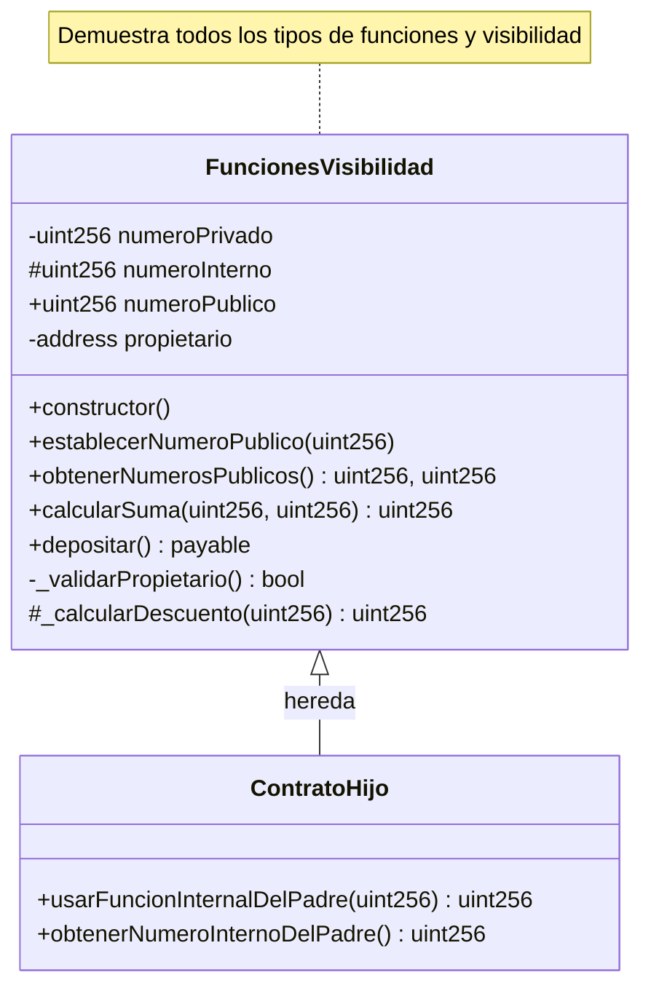

# 05. Funciones y Visibilidad

Esta sección explora en profundidad las funciones en Solidity y sus diferentes niveles de visibilidad. Comprende cómo funcionan los modificadores de función y cuándo usar cada tipo para escribir contratos seguros y eficientes.

## 📚 ¿Qué aprenderás?

En este módulo aprenderás sobre:
- Tipos de función (`pure`, `view`, `payable`)
- Niveles de visibilidad (`public`, `private`, `internal`, `external`)
- Herencia y acceso a funciones
- Optimización de gas en funciones
- Patrones de seguridad

## 📊 Diagrama UML del Contrato



**Leyenda de Visibilidad:**
- `+` = public (acceso total)
- `-` = private (solo este contrato)
- `#` = internal (este contrato + heredados)

## Temas cubiertos

### Tipos de Función

- **`pure`**: Funciones que no leen ni modifican el estado del contrato. Solo trabajan con los parámetros de entrada.
- **`view`**: Funciones que leen el estado del contrato pero no lo modifican.
- **`payable`**: Funciones que pueden recibir Ether junto con la llamada a la función.
- **Funciones normales**: Pueden leer y modificar el estado del contrato.

### Niveles de Visibilidad

- **`public`**: Accesible desde cualquier lugar (dentro y fuera del contrato).
- **`private`**: Solo accesible desde el mismo contrato donde se define.
- **`internal`**: Accesible desde el mismo contrato y contratos que hereden de él.
- **`external`**: Solo accesible desde fuera del contrato (no desde el mismo contrato).

## Conceptos Importantes

### Gas y Eficiencia
- Las funciones `pure` y `view` no consumen gas cuando se llaman externamente.
- Las funciones `payable` son necesarias para recibir Ether.
- Elegir la visibilidad correcta es crucial para la seguridad del contrato.

### Mejores Prácticas
- Usa `pure` cuando no necesites acceso al estado.
- Usa `view` cuando solo necesites leer datos.
- Marca como `private` o `internal` las funciones auxiliares.
- Usa `external` para funciones que solo se llaman desde fuera.

## Ejemplo básico

```solidity
// SPDX-License-Identifier: MIT
pragma solidity ^0.8.0;

contract FuncionesVisibilidad {
    uint256 private numero;
    
    // Función public que modifica estado
    function establecerNumero(uint256 _numero) public {
        numero = _numero;
    }
    
    // Función view que lee estado
    function obtenerNumero() public view returns (uint256) {
        return numero;
    }
    
    // Función pure que no accede al estado
    function sumar(uint256 a, uint256 b) public pure returns (uint256) {
        return a + b;
    }
    
    // Función payable que puede recibir Ether
    function depositar() public payable {
        // Función que puede recibir Ether
    }
}
```

## 🔍 Tipos de Función en Detalle

### 1. Funciones Pure

**No leen ni modifican el estado del contrato**

```solidity
function calcularSuma(uint256 a, uint256 b) public pure returns (uint256) {
    return a + b;
}

function calcularFactorial(uint256 n) external pure returns (uint256) {
    if (n == 0 || n == 1) return 1;
    uint256 resultado = 1;
    for (uint256 i = 2; i <= n; i++) {
        resultado *= i;
    }
    return resultado;
}
```

**Características:**
- ✅ Solo usan parámetros y variables locales
- ✅ No consumen gas en llamadas externas
- ✅ Ideales para cálculos matemáticos
- ❌ No pueden leer variables de estado
- ❌ No pueden emitir eventos

### 2. Funciones View

**Leen el estado pero no lo modifican**

```solidity
function obtenerBalance(address _address) external view returns (uint256) {
    return balances[_address];
}

function obtenerInfoUsuario(address _addr) public view returns (
    string memory nombre,
    uint256 edad,
    uint256 saldo
) {
    Usuario memory user = usuarios[_addr];
    return (user.nombre, user.edad, user.saldo);
}
```

**Características:**
- ✅ Pueden leer variables de estado
- ✅ No consumen gas en llamadas externas
- ✅ Pueden llamar otras funciones `view` o `pure`
- ❌ No pueden modificar estado
- ❌ No pueden emitir eventos

### 3. Funciones Payable

**Pueden recibir Ether**

```solidity
function depositar() public payable {
    require(msg.value > 0, "Debe enviar algo de Ether");
    balances[msg.sender] += msg.value;
    emit DepositoRecibido(msg.sender, msg.value);
}

function comprar(uint256 cantidad) external payable {
    uint256 precio = cantidad * precioPorUnidad;
    require(msg.value >= precio, "Pago insuficiente");
    
    // Procesar compra
    inventario[msg.sender] += cantidad;
    
    // Devolver exceso
    if (msg.value > precio) {
        uint256 exceso = msg.value - precio;
        (bool success, ) = payable(msg.sender).call{value: exceso}("");
        require(success, "Devolucion fallida");
    }
}
```

**Características:**
- ✅ Único tipo que puede recibir Ether
- ✅ Acceso a `msg.value`
- ✅ Pueden modificar estado
- ⚠️ Requieren manejo cuidadoso de fondos

### 4. Funciones Normales

**Pueden leer y modificar el estado**

```solidity
function establecerNumero(uint256 _numero) public {
    numero = _numero;
    emit NumeroActualizado(_numero);
}

function procesarTransferencia(address destinatario, uint256 cantidad) public {
    require(balances[msg.sender] >= cantidad, "Saldo insuficiente");
    
    balances[msg.sender] -= cantidad;
    balances[destinatario] += cantidad;
    
    emit Transferencia(msg.sender, destinatario, cantidad);
}
```

## 🔐 Niveles de Visibilidad en Detalle

### Tabla Comparativa

| Visibilidad | Mismo Contrato | Contratos Heredados | Contratos Externos | Transacciones Externas |
|-------------|----------------|---------------------|-------------------|------------------------|
| `private` | ✅ | ❌ | ❌ | ❌ |
| `internal` | ✅ | ✅ | ❌ | ❌ |
| `public` | ✅ | ✅ | ✅ | ✅ |
| `external` | ❌ | ❌ | ✅ | ✅ |

### 1. Public

```solidity
uint256 public numeroPublico;  // Getter automático

function establecerNumero(uint256 _numero) public {
    numeroPublico = _numero;
}
```

**Uso:**
- Variables de estado que necesitan ser leídas externamente
- Funciones accesibles desde cualquier lugar
- Interfaces de contrato

**Costo:**
- Más costoso en gas que `external` para llamadas externas

### 2. External

```solidity
function procesarDatosGrandes(uint256[] calldata datos) external {
    // Más eficiente con calldata
}

function obtenerBalanceExternal(address _address) external view returns (uint256) {
    return balances[_address];
}
```

**Uso:**
- Funciones solo llamadas externamente
- Mejor con parámetros grandes (usa `calldata`)
- Interfaces públicas del contrato

**Ventaja:**
- ⚡ Más eficiente en gas para llamadas externas

### 3. Internal

```solidity
function _calcularDescuento(uint256 monto) internal pure returns (uint256) {
    if (monto >= 1000) return monto * 10 / 100;
    if (monto >= 500) return monto * 5 / 100;
    return 0;
}

function _actualizarNumeroInterno(uint256 _numero) internal {
    numeroInterno = _numero;
}
```

**Uso:**
- Funciones auxiliares compartidas con contratos heredados
- Lógica reutilizable en herencia
- Funciones helper

### 4. Private

```solidity
function _validarPropietario() private view returns (bool) {
    return msg.sender == propietario;
}

function _calcularInteres(uint256 principal, uint256 tasa) private pure returns (uint256) {
    return (principal * tasa) / 100;
}
```

**Uso:**
- Funciones auxiliares solo para el contrato actual
- Lógica interna sensible
- Helper functions que no deben heredarse

## 💡 Ejercicios Incluidos en el Contrato

### Sistema de Puntuación
- Validación con funciones `private`
- Cálculo de bonus con funciones `internal`
- Gestión pública con funciones `external`

### Sistema de Donaciones
- Recepción de fondos con `payable`
- Consultas con `view`
- Eventos para tracking

### Validador de Números
- Funciones `pure` para validaciones
- Algoritmos matemáticos (primos, perfectos)

### Sistema de Votación
- Structs complejos
- Mappings anidados
- Control de acceso con modificadores

## 🎯 Patrones y Mejores Prácticas

### Patrón: Función Helper Privada

```solidity
function procesarPago(uint256 cantidad) public {
    require(_validarUsuario(msg.sender), "Usuario invalido");
    require(_validarCantidad(cantidad), "Cantidad invalida");
    
    _ejecutarPago(cantidad);
}

function _validarUsuario(address usuario) private view returns (bool) {
    return usuarios[usuario].activo;
}

function _validarCantidad(uint256 cantidad) private pure returns (bool) {
    return cantidad > 0 && cantidad <= 1000000;
}

function _ejecutarPago(uint256 cantidad) private {
    balances[msg.sender] -= cantidad;
    emit PagoRealizado(msg.sender, cantidad);
}
```

### Patrón: Getter Personalizado

```solidity
// Variable private con getter público personalizado
uint256 private numeroSecreto;

function obtenerNumeroSecreto() public view returns (uint256) {
    require(msg.sender == propietario, "Solo el propietario");
    return numeroSecreto;
}
```

### Patrón: External con Calldata

```solidity
// Más eficiente para arrays grandes
function procesarLista(uint256[] calldata lista) external pure returns (uint256) {
    uint256 suma = 0;
    for (uint256 i = 0; i < lista.length; i++) {
        suma += lista[i];
    }
    return suma;
}
```

## ⚡ Optimización de Gas

### Public vs External

```solidity
// ❌ Menos eficiente para llamadas externas
function funcionPublica(uint256[] memory datos) public returns (uint256) {
    // memory copia los datos
}

// ✅ Más eficiente para llamadas externas
function funcionExternal(uint256[] calldata datos) external returns (uint256) {
    // calldata no copia, solo referencia
}
```

### Comparación de Costos

| Escenario | Public | External | Ahorro |
|-----------|--------|----------|--------|
| Llamada externa simple | ~500 gas | ~400 gas | 20% |
| Con array grande | ~5000 gas | ~2000 gas | 60% |
| Solo lectura (view) | 0 gas | 0 gas | - |

## 🔒 Seguridad

### 1. Principio de Menor Privilegio

```solidity
// ✅ Correcto: función sensible es private
function _transferirFondos(address destino, uint256 cantidad) private {
    require(balances[address(this)] >= cantidad, "Fondos insuficientes");
    (bool success, ) = payable(destino).call{value: cantidad}("");
    require(success, "Transferencia fallida");
}

// ❌ Peligroso: función sensible es public
function transferirFondos(address destino, uint256 cantidad) public {
    // Cualquiera puede llamar esto!
}
```

### 2. Validación en Funciones Payable

```solidity
function comprarToken() public payable {
    require(msg.value > 0, "Debe enviar Ether");
    require(msg.value >= precioMinimo, "Pago insuficiente");
    require(tokensDisponibles > 0, "Sin stock");
    
    uint256 cantidadTokens = msg.value / precioToken;
    tokens[msg.sender] += cantidadTokens;
    tokensDisponibles -= cantidadTokens;
}
```

### 3. Herencia Segura

```solidity
contract Base {
    uint256 internal datoProtegido;
    
    function _actualizarDato(uint256 valor) internal {
        require(valor > 0, "Valor invalido");
        datoProtegido = valor;
    }
}

contract Derivado is Base {
    function establecerDato(uint256 valor) public {
        _actualizarDato(valor);  // Usa función internal del padre
    }
}
```

## 📝 Checklist de Desarrollo

- [ ] Usar `pure` para funciones sin acceso a estado
- [ ] Usar `view` para funciones de solo lectura
- [ ] Marcar `payable` solo funciones que reciben Ether
- [ ] Preferir `external` para funciones públicas con parámetros grandes
- [ ] Usar `private` para helpers internos
- [ ] Usar `internal` para lógica compartida con herederos
- [ ] Documentar visibilidad y modificadores
- [ ] Validar entradas en funciones `payable`
- [ ] Limitar acceso a funciones sensibles

## Recomendaciones

- **Seguridad primero**: Usa el modificador más restrictivo posible
- **Gas efficiency**: Prefiere `external` con `calldata` para interfaces públicas
- **Claridad**: Las funciones `pure` y `view` hacen el código más legible
- **Documentación**: Comenta el propósito y restricciones de cada función
- **Testing**: Prueba todos los niveles de acceso

## 🚀 Próximos Pasos

Con las funciones y visibilidad dominadas, estarás listo para:
- Crear estructuras de datos complejas (Tema 6: Mappings y Structs)
- Implementar patrones de diseño avanzados
- Construir sistemas con herencia múltiple
- Optimizar contratos para producción

---

¡Domina las funciones y visibilidad para construir contratos seguros y eficientes! 🔐