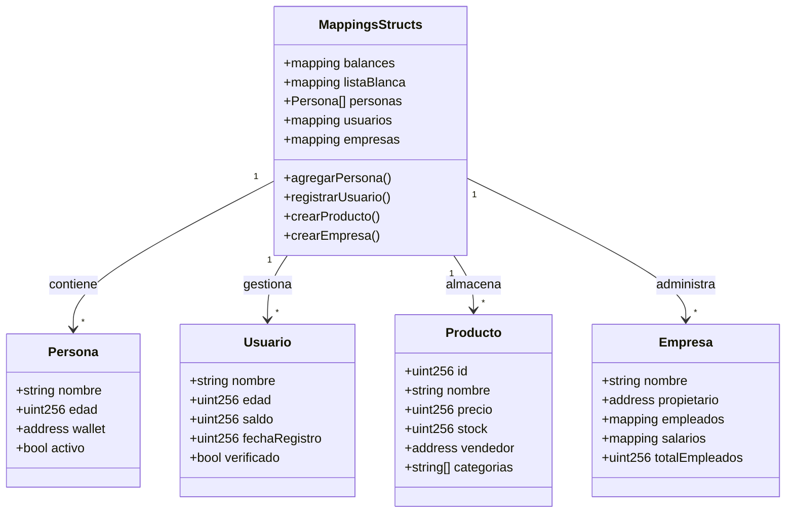

# 06. Mappings y Structs

Esta sección explora dos de las estructuras de datos más importantes y utilizadas en Solidity: **Mappings** y **Structs**. Aprenderás a crear estructuras de datos complejas y eficientes para almacenar y organizar información en tus contratos inteligentes.

## 📚 ¿Qué aprenderás?

En este módulo aprenderás sobre:
- Mappings simples y anidados
- Structs básicos y complejos
- Combinación de mappings y structs
- Arrays de structs
- Structs con mappings internos
- Patrón array + mapping para iteración
- Proyectos completos (Biblioteca, NFT, Votación, Red Social)

## 📊 Diagrama UML del Contrato



## Temas cubiertos

### Mappings (Mapeos)

Los mappings son estructuras de datos clave-valor, similares a diccionarios o hash tables en otros lenguajes.

**Características:**
- Permiten buscar valores de forma eficiente mediante una clave
- No tienen longitud ni se pueden iterar directamente
- Todas las claves posibles existen, devuelven valor por defecto si no se ha asignado
- Son muy eficientes en gas para acceso y modificación

**Tipos comunes:**
- `mapping(address => uint256)` - Balances de cuentas
- `mapping(uint256 => string)` - IDs a nombres
- `mapping(address => bool)` - Listas blancas/negras
- `mapping(address => mapping(uint256 => bool))` - Mappings anidados

### Structs (Estructuras)

Los structs permiten crear tipos de datos personalizados agrupando variables relacionadas.

**Características:**
- Agrupan datos relacionados en una sola estructura
- Pueden contener cualquier tipo de dato (incluidos arrays y otros structs)
- Se pueden usar en arrays y mappings
- Permiten organizar código de forma más clara y mantenible

### Combinación de Mappings y Structs

La combinación de estas dos estructuras es muy poderosa:
- `mapping(address => Struct)` - Asociar estructuras complejas a direcciones
- `mapping(uint256 => Struct[])` - Arrays de structs indexados
- Structs que contienen mappings para relaciones complejas

## Casos de uso comunes

- **Sistema de usuarios**: `mapping(address => Usuario)`
- **Registro de productos**: `mapping(uint256 => Producto)`
- **Sistema de votación**: `mapping(uint256 => Propuesta)` con votos
- **Marketplace**: Vendedores, compradores y productos
- **Registros médicos**: Pacientes y sus historiales

## Ejemplo básico

```solidity
// SPDX-License-Identifier: MIT
pragma solidity ^0.8.0;

contract EjemploBasico {
    // Struct para representar una persona
    struct Persona {
        string nombre;
        uint256 edad;
        bool activo;
    }
    
    // Mapping de address a Persona
    mapping(address => Persona) public personas;
    
    // Mapping simple de address a balance
    mapping(address => uint256) public balances;
    
    // Función para agregar persona
    function agregarPersona(string memory _nombre, uint256 _edad) public {
        personas[msg.sender] = Persona(_nombre, _edad, true);
    }
    
    // Función para obtener persona
    function obtenerPersona(address _addr) public view returns (string memory, uint256, bool) {
        Persona memory persona = personas[_addr];
        return (persona.nombre, persona.edad, persona.activo);
    }
}
```

## Mejores prácticas

1. **Uso de Mappings:**
   - Usa mappings cuando necesites buscar datos por clave
   - No intentes iterar sobre mappings (usa arrays adicionales si necesitas iterar)
   - Los mappings solo pueden ser variables de estado

2. **Uso de Structs:**
   - Agrupa datos relacionados lógicamente
   - Usa `memory` para structs temporales en funciones
   - Usa `storage` cuando modifiques structs de variables de estado

3. **Optimización de Gas:**
   - Ordena los campos del struct por tamaño para optimizar storage
   - Usa tipos de datos apropiados (uint8, uint16, etc.) cuando sea posible
   - Evita copiar structs grandes innecesariamente

4. **Seguridad:**
   - Valida datos antes de almacenarlos
   - Considera usar modificadores para controlar acceso
   - Ten cuidado con mappings anidados complejos

## 🔍 Mappings en Detalle

### Mappings Simples

```solidity
// Tipos comunes de mappings
mapping(address => uint256) public balances;
mapping(address => bool) public listaBlanca;
mapping(uint256 => string) public nombres;
```

**Características clave:**
- ✅ Búsqueda O(1) - muy eficiente
- ✅ No necesitan inicialización
- ✅ Devuelven valor por defecto si la clave no existe
- ❌ No se pueden iterar directamente
- ❌ No tienen propiedad `.length`

### Mappings Anidados

```solidity
// Mapping de mapping
mapping(address => mapping(uint256 => bool)) public calificaciones;
mapping(address => mapping(address => bool)) public operadores;

// Uso
calificaciones[profesor][idCurso] = true;
operadores[propietario][operador] = true;
```

**Casos de uso:**
- Permisos por usuario y recurso
- Calificaciones por alumno y curso
- Aprobaciones en tokens (allowance)

### Patrón: Mapping + Array para Iteración

```solidity
address[] public listaUsuarios;
mapping(address => bool) private usuarioExiste;

function agregarUsuario(address _usuario) public {
    require(!usuarioExiste[_usuario], "Usuario ya existe");
    
    listaUsuarios.push(_usuario);
    usuarioExiste[_usuario] = true;
}

function obtenerTodosUsuarios() public view returns (address[] memory) {
    return listaUsuarios;
}
```

## 🏗️ Structs en Detalle

### Struct Básico

```solidity
struct Persona {
    string nombre;
    uint256 edad;
    address wallet;
    bool activo;
}

Persona[] public personas;

function agregarPersona(string memory _nombre, uint256 _edad) public {
    personas.push(Persona({
        nombre: _nombre,
        edad: _edad,
        wallet: msg.sender,
        activo: true
    }));
}
```

### Struct Complejo

```solidity
struct Producto {
    uint256 id;
    string nombre;
    string descripcion;
    uint256 precio;
    uint256 stock;
    address vendedor;
    bool disponible;
    string[] categorias;
    uint256 fechaCreacion;
}
```

### Struct con Mapping (Solo Storage)

```solidity
struct Empresa {
    string nombre;
    address propietario;
    mapping(address => bool) empleados;
    mapping(address => uint256) salarios;
    uint256 totalEmpleados;
}

mapping(uint256 => Empresa) public empresas;
```

⚠️ **Importante**: Structs con mappings solo pueden existir en `storage`, no en `memory`.

## 💡 Proyectos Incluidos

### 1. Biblioteca Digital
```solidity
struct Libro {
    string titulo;
    string autor;
    uint256 anioPublicacion;
    bool disponible;
    address prestadoA;
    uint256 fechaPrestamo;
}
```
**Funcionalidades:**
- Agregar libros
- Prestar y devolver libros
- Consultar disponibilidad

### 2. Sistema de Tareas
```solidity
struct Tarea {
    string descripcion;
    bool completada;
    uint256 prioridad;
    uint256 fechaCreacion;
    uint256 fechaCompletada;
}

mapping(address => Tarea[]) public tareasUsuario;
```
**Funcionalidades:**
- Crear tareas con prioridades
- Marcar como completadas
- Contar tareas pendientes

### 3. Marketplace NFT
```solidity
struct NFT {
    uint256 tokenId;
    string nombre;
    string uri;
    address propietario;
    uint256 precio;
    bool enVenta;
}
```
**Funcionalidades:**
- Crear NFTs
- Poner a la venta
- Comprar NFTs
- Transferir propiedad

### 4. Sistema de Votación Avanzado
```solidity
struct Candidato {
    string nombre;
    string propuesta;
    uint256 votos;
    bool activo;
}

struct Eleccion {
    string nombre;
    uint256 fechaInicio;
    uint256 fechaFin;
    bool activa;
    mapping(uint256 => Candidato) candidatos;
    mapping(address => bool) haVotado;
    uint256 totalCandidatos;
    uint256 totalVotos;
}
```
**Funcionalidades:**
- Crear elecciones
- Agregar candidatos
- Votar con validación
- Cerrar elección y obtener ganador

### 5. Red Social Descentralizada
```solidity
struct Publicacion {
    uint256 id;
    address autor;
    string contenido;
    uint256 timestamp;
    uint256 likes;
    mapping(address => bool) likesDe;
}

struct Perfil {
    string nombre;
    string bio;
    uint256[] publicaciones;
    uint256 seguidores;
    uint256 siguiendo;
}
```
**Funcionalidades:**
- Crear perfil
- Publicar contenido
- Dar likes
- Seguir/dejar de seguir usuarios

## 🎯 Patrones y Mejores Prácticas

### Patrón: Acceso Seguro a Struct

```solidity
function obtenerUsuario(address _addr) public view returns (
    string memory nombre,
    uint256 edad,
    uint256 saldo,
    bool verificado
) {
    require(bytes(usuarios[_addr].nombre).length > 0, "Usuario no existe");
    Usuario memory user = usuarios[_addr];
    return (user.nombre, user.edad, user.saldo, user.verificado);
}
```

### Patrón: Actualización Incremental

```solidity
function actualizarPerfil(string memory _nombre, string memory _bio) public {
    require(bytes(perfiles[msg.sender].nombre).length > 0, "Perfil no existe");
    
    // Solo actualizar campos específicos
    perfiles[msg.sender].nombre = _nombre;
    perfiles[msg.sender].bio = _bio;
    // Otros campos permanecen sin cambios
}
```

### Patrón: Validación Antes de Guardar

```solidity
function crearProducto(
    string memory _nombre,
    uint256 _precio,
    uint256 _stock
) public returns (uint256) {
    require(bytes(_nombre).length > 0, "Nombre requerido");
    require(_precio > 0, "Precio invalido");
    require(_stock > 0, "Stock invalido");
    
    uint256 nuevoId = contadorProductos;
    productos[nuevoId] = Producto({
        id: nuevoId,
        nombre: _nombre,
        precio: _precio,
        stock: _stock,
        vendedor: msg.sender,
        disponible: true
    });
    
    contadorProductos++;
    return nuevoId;
}
```

## ⚡ Optimización de Gas

### 1. Orden de Campos en Struct

```solidity
// ❌ No optimizado (usa 3 slots)
struct Usuario {
    uint256 saldo;      // 32 bytes - slot 0
    uint8 edad;         // 1 byte - slot 1
    uint256 timestamp;  // 32 bytes - slot 2
}

// ✅ Optimizado (usa 2 slots)
struct Usuario {
    uint256 saldo;      // 32 bytes - slot 0
    uint256 timestamp;  // 32 bytes - slot 1
    uint8 edad;         // 1 byte - slot 2 (puede compartir con otros)
}
```

### 2. Tipos de Datos Apropiados

```solidity
// ❌ Desperdicio de espacio
struct Producto {
    uint256 stock;      // 0-255 es suficiente
    uint256 categoria;  // Solo hay 10 categorías
}

// ✅ Eficiente
struct Producto {
    uint8 stock;        // 0-255
    uint8 categoria;    // 0-255
}
```

### 3. Memory vs Storage

```solidity
// ✅ Lectura eficiente
function obtenerNombre(uint256 id) public view returns (string memory) {
    return productos[id].nombre;  // Lee solo un campo
}

// ❌ Copia innecesaria
function obtenerNombre(uint256 id) public view returns (string memory) {
    Producto memory prod = productos[id];  // Copia todo el struct
    return prod.nombre;
}
```

## 🔒 Seguridad

### Validación de Existencia

```solidity
function existeUsuario(address _addr) private view returns (bool) {
    return bytes(usuarios[_addr].nombre).length > 0;
}

function actualizarUsuario(string memory _nombre) public {
    require(existeUsuario(msg.sender), "Usuario no registrado");
    usuarios[msg.sender].nombre = _nombre;
}
```

### Protección contra Sobrescritura

```solidity
function registrarUsuario(string memory _nombre) public {
    require(!existeUsuario(msg.sender), "Usuario ya existe");
    
    usuarios[msg.sender] = Usuario({
        nombre: _nombre,
        edad: 0,
        saldo: 0,
        fechaRegistro: block.timestamp,
        verificado: false
    });
}
```

### Limpieza de Datos

```solidity
function eliminarUsuario() public {
    require(existeUsuario(msg.sender), "Usuario no existe");
    
    delete usuarios[msg.sender];  // Resetea a valores por defecto
    // Para arrays, considera mantener un registro de usuarios eliminados
}
```

## 📝 Comparación: Mapping vs Array vs Struct

| Característica | Mapping | Array | Struct |
|----------------|---------|-------|--------|
| Búsqueda | O(1) | O(n) | N/A |
| Iteración | ❌ No | ✅ Sí | N/A |
| Longitud | ❌ No | ✅ Sí | N/A |
| Valores por defecto | ✅ Sí | ❌ No | ✅ Sí |
| En memoria | ❌ No | ✅ Sí | ✅ Sí |
| Agrupación de datos | ❌ No | ❌ No | ✅ Sí |

## Limitaciones importantes

### Mappings
- ❌ No se pueden retornar directamente de funciones
- ❌ No tienen propiedad `.length`
- ❌ No se pueden iterar
- ❌ Solo existen en `storage`
- ❌ No se pueden usar como parámetros de función

### Structs
- ❌ No pueden contener su propio tipo recursivamente
- ❌ Structs con mappings solo en `storage`
- ⚠️ Copiar structs grandes consume mucho gas

## 🚀 Próximos Pasos

Con mappings y structs dominados, estarás listo para:
- Implementar eventos y logs (Próximo tema)
- Crear sistemas de manejo de errores robustos
- Trabajar con herencia y interfaces
- Construir DApps completas con backend en blockchain

---

¡Domina mappings y structs para construir sistemas de datos complejos y eficientes! 🏗️