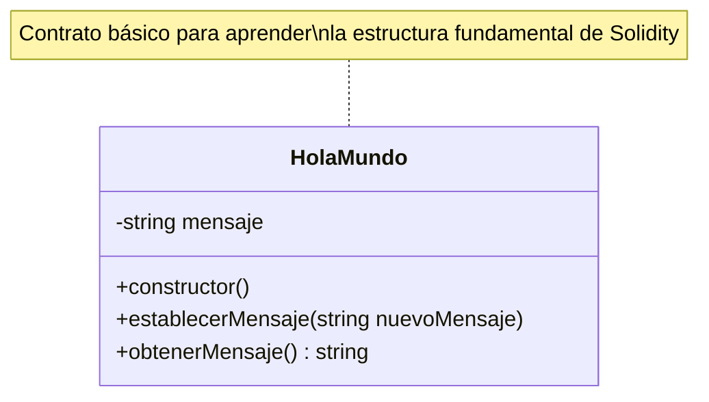
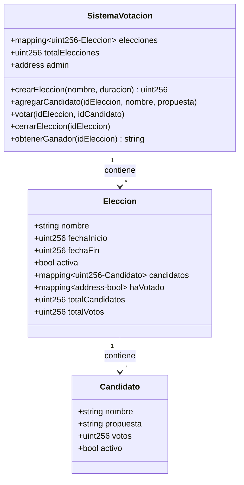

# 🚀 Mi Patio de Juegos de Contratos Inteligentes con Solidity

¡Hola! Soy Omar 👋

Bienvenido a mi repositorio de aprendizaje y experimentación con **Solidity**, el lenguaje para crear contratos inteligentes en Ethereum y otras blockchains compatibles. Aquí encontrarás ejemplos prácticos, explicaciones claras y ejercicios para que aprendas desde cero y consolides tus conocimientos.

---

## 📂 Estructura del Repositorio

Los ejemplos están organizados en carpetas autocontenidas, cada una enfocada en un tema o conjunto de conceptos específico. Cada carpeta incluye contratos, ejercicios y documentación para que puedas practicar y entender cada concepto.

* **`1. Hello World`**:
    * ¡Mi primera inmersión en Solidity! Un contrato simple de "Hola Mundo" para aprender la estructura básica, variables de estado y funciones.

* **`2. Tipos de Dato`**:
    * Explora los tipos de datos en Solidity: enteros, booleanos, direcciones, arrays y más. Incluye ejemplos de declaración, asignación y manipulación.

* **`3. Operadores`**:
    * Aprende a usar operadores aritméticos, de comparación, lógicos y de bits en tus contratos inteligentes. Ejemplos prácticos para entender su funcionamiento.

* **`4. Estructuras de Control`**:
    * Controla el flujo de ejecución en tus contratos inteligentes. Ejemplos de condicionales (`if`, `else`, `else if`), bucles (`for`, `while`, `do/while`), y control de flujo (`break`, `continue`, `return`). Incluye ejercicios y explicaciones detalladas para dominar la lógica de tus contratos. ¡Ahora con ejercicios prácticos como suma de pares, cuenta regresiva, validación de números primos y más!

* **`5. Funciones y Visibilidad`**:
    * Domina las funciones en Solidity y sus niveles de visibilidad. Aprende la diferencia entre `pure`, `view`, `payable` y funciones normales. Explora `public`, `private`, `internal` y `external` con ejemplos prácticos. Incluye ejercicios completos como calculadoras, sistemas de votación, donaciones y validadores de números para practicar cada concepto.

* **`6. Mappings y Structs`**:
    * Aprende a crear estructuras de datos complejas con mappings y structs. Descubre mappings simples, anidados, structs con arrays y la combinación de ambos. Incluye proyectos completos como biblioteca digital, sistema de tareas, marketplace NFT, sistema de votación avanzado y red social descentralizada para dominar estas estructuras fundamentales.

---

## 📊 Visualización de Contratos

### Diagrama UML - Hola Mundo (Contrato Básico)



### Diagrama UML - Sistema de Votación Descentralizada



### Arquitectura del Proyecto

```
📁 Solidity Contracts
├── 📂 01. Hola_Mundo
│   └── Conceptos básicos
├── 📂 02. Tipos_de_Dato
│   └── Tipos primitivos y complejos
├── 📂 03. Operadores
│   └── Operaciones y comparaciones
├── 📂 04. Estructuras_de_Control
│   └── Condicionales y bucles
├── 📂 05. Funciones_y_Visibilidad
│   └── Modificadores y acceso
└── 📂 06. Mappings_y_Structs
    └── Estructuras de datos complejas
```

---

## 🎯 Conceptos Clave por Nivel

### 🟢 Principiante (Temas 1-3)
- Variables y tipos de datos
- Funciones básicas
- Operaciones matemáticas y lógicas
- Estructura de un contrato

### 🟡 Intermedio (Temas 4-5)
- Estructuras de control
- Visibilidad de funciones
- Modificadores `pure`, `view`, `payable`
- Eventos y logging

### 🔴 Avanzado (Tema 6+)
- Mappings y structs complejos
- Patrones de diseño
- Optimización de gas
- Sistemas completos (NFT, Votación, DeFi)

---

## 🔮 ¿Qué Sigue?

¡Este repositorio está en constante crecimiento! Próximamente se agregarán:
* **Eventos y Logs**: Aprendiendo a registrar eventos para aplicaciones fuera de la cadena.
* **Manejo de Errores**: Implementando `require`, `revert` y `assert` para una lógica de contrato robusta.
* **Herencia e Interfaces**: Construyendo sobre contratos existentes y usando interfaces estándar.
* **Modificadores Personalizados**: Creando validaciones reutilizables.
* **Patrones de Diseño**: Factory, Proxy, Upgradeable contracts.
* **Seguridad**: Reentrancy, overflow, access control.
* **Integración con Web3**: Conectar contratos con aplicaciones frontend.
* ¡Y mucho más!

---

## 🌱 Primeros Pasos

¿Cómo empezar?

1.  **Clona el repositorio:**
    ```bash
    git clone https://github.com/OmarQV/Solidity.git
    ```
2.  **Navega a la carpeta que te interese:**
3.  **Abre los archivos `.sol` en [Remix](https://remix.ethereum.org/)**, compílalos y despliega los contratos en una red de prueba para interactuar y experimentar.

---

## 🤝 Contribuciones y Comentarios

Este es un repositorio de aprendizaje abierto. Si tienes sugerencias, encuentras errores o quieres proponer nuevos temas, ¡abre un *issue* o contáctame! Tu feedback es bienvenido.

---

¡Feliz programación y que tus contratos sean seguros y eficientes! 🚀
